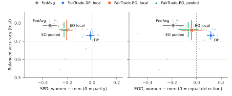

# Fair Federated Learning on Real Hospital Data

[](https://github.com/JordanManoj/fair-fl-medical/actions/workflows/tests.yml)

Does fair federated learning survive a real cross-silo medical federation?
This repository tests FedAvg and **FairTrade** (Badar et al., AAAI 2024) on
[FLamby](https://github.com/owkin/FLamby)'s **Fed-Heart-Disease**: 4 hospitals,
740 patients, sex as the sensitive attribute. Every number is a mean with a
95% confidence interval over 10 seeds. Model selection uses validation data
only.

**Report (5 pages):** [report/report.pdf](report/report.pdf) · **Run log with every decision:** [results/LOG.md](results/LOG.md)

## Findings

1. **FLamby's pooled-test convention overstates FL accuracy.** FedAvg scores
   0.748 on FLamby's pooled test (reproduced exactly) but 0.705 under the
   per-hospital normalization the clients actually train with.
2. **Every accuracy gain widens the sex gap.** From FedAvg (balanced acc
   0.704) to federated normalization (0.764) to pooled training (0.795), the
   statistical parity difference grows from −0.16 to −0.24 to −0.32.
3. **For diagnosis, equal opportunity beats demographic parity.** Heart
   disease affects 60% of men but 25% of women in this data. Demographic
   parity removes the gap in prediction rates but over-diagnoses women
   (EOD +0.11). Equal-opportunity FairTrade closes the detection gap
   (EOD −0.19 → −0.04), keeps more accuracy, and covers significantly more of
   the trade-off space (p = 0.039).
4. **FairTrade beats FedFB and Fed-FUEL on the real hospitals.** Under one
   protocol (same trainer, splits, validation-only selection), FairTrade has
   the best trade-off in both notions, and equal-opportunity FairTrade is the
   only method whose accuracy cost is not significant once test-sampling noise
   is included (two-level bootstrap).
5. **FairTrade's per-client penalty switches off when no client sees both
   sexes.** A FedGFT-style global penalty (Wang et al., 2023), built from four
   securely aggregatable group totals per client, keeps it working:
   hypervolume +0.081 (p < 0.001) under full segregation. It is never
   significantly worse elsewhere.

<p align="center"></p>

## Quickstart

Requires Python 3.10 or 3.11, git and bash (Git Bash on Windows). Everything
runs on a CPU.

```bash
git clone https://github.com/JordanManoj/fair-fl-medical.git
cd fair-fl-medical
bash scripts/setup.sh          # venv in ./.venv, FLamby pinned to edacf54, data -> data/heart
source .venv/bin/activate      # Windows Git Bash: source .venv/Scripts/activate
python -m pytest tests         # 13 unit tests (1 skips unless the original FairTrade code is in external/)
python scripts/run_fedavg.py   # FedAvg baseline, ~45 s
```

`setup.sh` clones FLamby into `external/`, installs only its `heart` extra,
re-applies the pins in `requirements.txt`, and downloads the four UCI files.
The download asks you to accept the dataset's CC BY 4.0 terms. Options:
`PYTHON=/path/to/python3.11` picks the interpreter, and `HEART_DATA=/path`
reuses an existing download (verified by MD5) instead of downloading.

## Reproducing the results

| Result | Command | Output | CPU time |
|---|---|---|---|
| FedAvg, 3 normalizations | `python scripts/run_fedavg.py --norm {local,federated,federated-impute} --seeds $(seq 42 51)` | `results/fedavg_heart_<norm>.csv` | ~1.5 min each |
| Local and pooled baselines | `python scripts/run_baselines.py` | `results/baselines_heart.csv` | ~5 min |
| Leave-one-hospital-out | `python scripts/run_loho.py` | `results/loho_heart.csv` | ~15 min |
| FairTrade, 2×2 notion × scope | `python scripts/run_fairtrade.py --notion {dp,eo} --scope {local,global}` | `results/fairtrade_*_<notion>_<scope>.csv` | ~10 min each |
| 2×2 comparison table | `python scripts/compare_fairtrade.py` | stdout | seconds |
| FedAvg vs FairTrade vs FedFB vs Fed-FUEL, with bootstrap | `python scripts/run_compare.py`, then `--summarize` | `results/compare/` | ~15 min |
| Segregation stress test | `python scripts/run_stress.py --segregation {0.0,0.5,0.8,1.0}`, then `--summarize` | `results/stress_s<level>.csv` | ~25 min per level |
| Report figures | `python scripts/make_figures.py` | `report/fig_*.svg` | seconds |

All result CSVs are committed, so tables and figures can be regenerated
without re-running training. The runs were made on Windows; floating-point
differences across platforms can flip an occasional borderline prediction.

## Design decisions

- **Validation-only selection.** Each hospital's training split is divided
  75/25 into fit and validation parts per seed. MOBO, learning-rate tuning
  and operating-point choice never see the test set.
- **Preprocessing fit on training data only.** That covers normalization and
  imputation of zero-coded missing cholesterol and blood pressure.
- **Soft fairness gaps for selection.** A validation split has about 6 sick
  women, so the thresholded EOD jumps about 16 points per patient. Selection
  uses gaps in mean predicted risk; test results use the usual thresholded
  SPD and EOD.
- **Same trainer for every compared method.** FedAvg in the FairTrade
  experiments is the same code with α = 0 and a tuned learning rate.
- **Undefined is n/a, never 0.** Switzerland's test set has no women.
- **The FairTrade port fixes six issues** found in my earlier challenge
  implementation: test-set tuning, a degenerate hypervolume reference point,
  shared-model mutation across candidates, a double sigmoid, unweighted
  averaging, and a crashing ATE option. See [fairfl/fairtrade.py](fairfl/fairtrade.py).
  A unit test checks numerical equivalence with the original penalty.

## Dataset notes

| Hospital | Train | Test | Women (train / test) | Disease rate (train) |
|---|---|---|---|---|
| Cleveland | 199 | 104 | 63 / 34 | 46% |
| Hungary | 172 | 89 | 50 / 19 | 38% |
| Switzerland | 30 | 16 | 3 / **0** | 100% |
| Long Beach VA | 85 | 45 | 2 / 3 | 78% |

The model sees 13 features, not the 16 that FLamby's README states: FLamby
drops UCI columns 10–12 and one-hot encodes `cp` and `restecg`. **Sex is
feature index 1** (1 = male, 0 = female). It is z-scored with the rest, so
group labels are read from a `normalize=False` copy (`fairfl/data.py`).
Cholesterol is recorded as 0 for every Switzerland patient and about 25% of
Long Beach patients.

## Layout

```
fairfl/     data loaders with sex labels, metrics + CIs, FairTrade, FedFB, Fed-FUEL, client partitioning
scripts/    setup and one script per experiment (see table above)
tests/      unit tests
results/    LOG.md (run log) and per-seed CSVs for every result
report/     report.pdf, its HTML source and figures
docs/       roadmap.html (project roadmap; open locally in a browser)
external/   FLamby clone, created by setup.sh (ignored)
data/       downloaded data (ignored)
```

## Credits and license

Code: MIT, see [LICENSE](LICENSE).
Data: Janosi, Steinbrunn, Pfisterer & Detrano (1988), *Heart Disease*, UCI
Machine Learning Repository, CC BY 4.0. The data is not redistributed here.
Benchmark: Ogier du Terrail et al., *FLamby*, NeurIPS 2022 Datasets and
Benchmarks (MIT).
Method: Badar, Sikdar, Nejdl & Fisichella, *FairTrade*, AAAI 2024.
Baselines ported from their official code: FedFB (Zeng, Chen & Lee, 2021) and
Fed-FUEL (Badar et al., DMKD 2025). The global penalty follows FedGFT
(Wang, Payani, Lee & Kompella, 2023).

Author: Jordan Manoj Cheruvathoor, MSc Informatik, Leibniz Universität Hannover.
